# Claude Second Brain

[](https://opensource.org/licenses/MIT)
[](https://code.claude.com/docs/en)
[](https://obsidian.md/)
[](https://code.claude.com/docs/en/channels)
[](https://github.com/ggerganov/whisper.cpp)

<p align="center">
  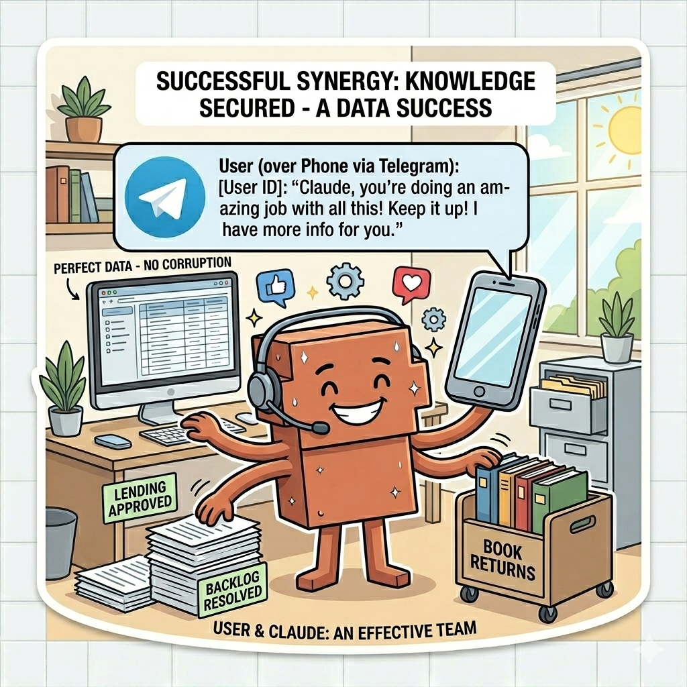
</p>

A complete autonomous [Claude Code](https://code.claude.com/docs/en) agent that maintains a personal knowledge base, runs overnight dream cycles, and stays reachable via Telegram — batteries included.

Built on the [Karpathy LLM Wiki](https://gist.github.com/karpathy/442a6bf555914893e9891c11519de94f) pattern and inspired by Anthropic's [Auto Dream](https://github.com/anthropics/claude-code/blob/main/docs/auto-dream.md) memory system.

## What This Is

An always-on AI second brain that:

- **Maintains a wiki knowledge base** — raw sources go in, curated articles come out (the Karpathy pattern)
- **Dreams overnight** — two cron-triggered dream cycles consolidate memory and compile new wiki articles while you sleep
- **Talks to you on Telegram** — text, voice messages, images, documents
- **Transcribes voice locally** — whisper.cpp, fully on-device, no cloud APIs
- **Works with Obsidian** — open the repo as a vault, get graph view of your knowledge for free
- **Enforces good behaviour** — a deterministic hook ensures Claude always acknowledges your Telegram messages before doing anything else

All infrastructure lives in dot-directories (`.channels/`, `.tools/`, `.hooks/`, `.claude/`, `.config/`) so Obsidian ignores them. Only knowledge content (`raw/`, `wiki/`, `output/`) and top-level files appear in your vault and graph view.

## Architecture

The system has two modes: **daytime** (interactive, Telegram-driven) and **overnight** (autonomous, cron-driven). Both share the same infrastructure.

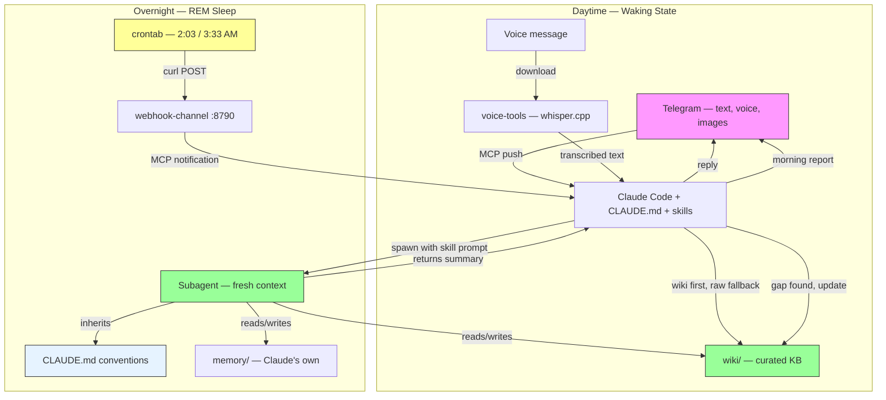

**How events flow:**
- **Telegram messages** arrive via the Telegram MCP server (push IN to the session)
- **Dream cycles** fire via cron → curl → webhook-channel → MCP notification → Claude routes to skill
- **Skills** spawn subagents with fresh context (no session bleed) to do the actual work — the subagent inherits CLAUDE.md conventions but has no session history to be biased by
- **Results** go to Telegram (morning reports) and wiki/log.md (audit trail)

## Features

| Feature | What It Does |
|---------|-------------|
| **LLM Wiki** | Raw sources compiled into curated, cross-linked wiki articles. The Karpathy pattern. |
| **Dream Cycles** | Overnight memory consolidation + wiki compilation via cron-triggered subagents |
| **Telegram** | Text, voice, images, documents. Always reachable. |
| **Voice Transcription** | whisper.cpp — fully local, no cloud APIs |
| **Telegram Gate Hook** | Deterministic enforcement: Claude must acknowledge messages before doing anything else |
| **Obsidian Compatible** | Dot-directories invisible to Obsidian. Wiki links render as graph. |
| **Subagent Architecture** | Dreams use fresh-context subagents to avoid the self-evaluation trap |
| **Compiled Manifest** | `.config/compiled-raw.txt` prevents reprocessing — O(1) inventory, not O(n) log scanning |
| **Skill Creator** | Anthropic's official skill for building and iterating on skills — the second brain can improve its own capabilities |

## Prerequisites

> Install instructions below are for macOS. For other platforms, see the linked documentation for each component.

- [Claude Code](https://code.claude.com/docs/en) — requires claude.ai login (Pro, Max, or Team/Enterprise). API key auth is not supported as [Channels require claude.ai login](https://code.claude.com/docs/en/channels-reference). Team and Enterprise organisations must explicitly enable Channels.
  - `npm install -g @anthropic-ai/claude-code`
- [Bun](https://bun.sh) (JavaScript runtime)
  - `curl -fsSL https://bun.sh/install | bash`
- Python 3 (for the Telegram gate hook — standard library only, no pip)
- A Telegram bot token (from [@BotFather](https://t.me/BotFather))
- [obsidian-skills](https://github.com/kepano/obsidian-skills) — Claude Code plugin that teaches Claude Obsidian-flavoured markdown (`[[wikilinks]]`, embeds, callouts, properties). Without it, Claude creates standard markdown links that don't work in Obsidian.
  - `/plugin marketplace add kepano/obsidian-skills`
  - `/plugin install obsidian@obsidian-skills`
- [skill-creator](https://github.com/anthropics/skills) — Anthropic's official skill for building, testing, and iterating on skills. Enables the second brain to improve its own capabilities based on your needs.
  - `npx skills add anthropics/skills@skill-creator`
- [Obsidian](https://obsidian.md/) (optional but recommended)

**Voice transcription** (optional — only needed for Telegram voice messages):

```bash
brew install ffmpeg
brew install whisper-cpp

# Download a model (~150MB)
mkdir -p /opt/homebrew/share/whisper-cpp/models
curl -L -o /opt/homebrew/share/whisper-cpp/models/ggml-base.en.bin \
  "https://huggingface.co/ggerganov/whisper.cpp/resolve/main/ggml-base.en.bin"
```

The model path is `/opt/homebrew/share/whisper-cpp/models/ggml-base.en.bin` on macOS. For other platforms, see the [whisper.cpp README](https://github.com/ggerganov/whisper.cpp).

## Quick Start

```bash
git clone https://github.com/jason-c-dev/claude-second-brain.git my-brain
cd my-brain && ./setup.sh
```

`setup.sh` handles:
- Installing npm dependencies in `.channels/webhook-channel/` and `.tools/voice-tools/`
- Creating `config.env` from the template
- Scaffolding empty directories
- Checking for whisper.cpp and ffmpeg
- Printing next steps

Then:

```bash
# 1. Edit config.env — set your Telegram chat ID
#    (find it by messaging @userinfobot on Telegram)

# 2. Set up Telegram (one-time — see below)

# 3. Install cron jobs for overnight dreams
(crontab -l 2>/dev/null; cat .config/crontab) | crontab -

# 4. Launch:
./start.sh

# Or with no permission prompts (use with caution):
./start.sh --dangerously
```

### Telegram Setup

`setup.sh` handles most of the Telegram configuration — it prompts for your bot token and chat ID, writes the credentials to the project-local state directory, and configures `.mcp.json` automatically.

**Before running `setup.sh`**, you need two things:

1. **A bot token** — create a bot via [@BotFather](https://t.me/BotFather) on Telegram
2. **Your chat ID** — message [@userinfobot](https://t.me/userinfobot) on Telegram

`setup.sh` will prompt for both and configure everything, including the `access.json` allowlist. No need to run `/telegram:configure` or `/telegram:access` manually.

**If the Telegram plugin isn't installed yet:**

The plugin needs to be installed once before `setup.sh` can detect its path:

1. Start a plain Claude session: `claude`
2. Install the plugin: `/plugin install telegram`
3. Exit the session
4. Re-run `./setup.sh` — it will detect the plugin and configure `.mcp.json`

See the [official guide](https://code.claude.com/docs/en/channels) for more details.

**How it works under the hood:**

- Bot token is stored in `.channels/telegram/.env` (project-local, not global)
- Access config is stored in `.channels/telegram/access.json` (project-local)
- `.mcp.json` points `TELEGRAM_STATE_DIR` to `.channels/telegram/` for per-instance isolation
- `.mcp.json` is gitignored (it contains local paths). The template `.mcp.example.json` is committed for reference.

**Why this matters — the dropped message fix:**

The default `plugin:` delivery path drops messages that arrive while Claude is mid-response (no queue, no retry — [#1143](https://github.com/anthropics/claude-plugins-official/issues/1143)). This repo works around it:

- Telegram is registered as an MCP server in `.mcp.json` (not as a channel plugin)
- `start.sh` uses `--dangerously-load-development-channels server:telegram` (not `plugin:telegram`)
- Each channel needs its own `--dangerously-load-development-channels` flag (comma-separated does NOT work)
- `./start.sh --dangerously` adds `--dangerously-skip-permissions` for fully autonomous operation (no permission prompts). Default launch has no permission flag — Claude uses its standard permission mode.

This gives reliable message delivery — every message arrives, even during long operations.

### Multiple Instances

Clone into different directories. Each gets its own vault, memory, config, and webhook port:

```bash
git clone https://github.com/jason-c-dev/claude-second-brain.git work-brain && cd work-brain && ./setup.sh
git clone https://github.com/jason-c-dev/claude-second-brain.git research-brain && cd research-brain && ./setup.sh
```

Change `WEBHOOK_PORT` in each instance's `config.env` to avoid port conflicts. Each `./setup.sh` prompts for a bot token and chat ID independently, so each instance gets its own credentials stored in `.channels/telegram/`.

**Running multiple instances simultaneously** requires a separate Telegram bot per instance (create one via @BotFather for each). If only one instance runs at a time, they can share the same bot.

> **Note:** Don't use `/telegram:configure` for multi-instance setups — it writes to the global state directory (`~/.claude/channels/telegram/`) and will overwrite your other instance's bot token. `setup.sh` writes to the project-local state directory instead.

## How It Works

### Wiki System

The wiki follows the [Karpathy LLM Wiki](https://gist.github.com/karpathy/442a6bf555914893e9891c11519de94f) pattern: instead of treating your LLM as a search engine that re-derives answers from scratch every time, treat it as a *librarian*. Give it a structured knowledge base. Let it maintain it.

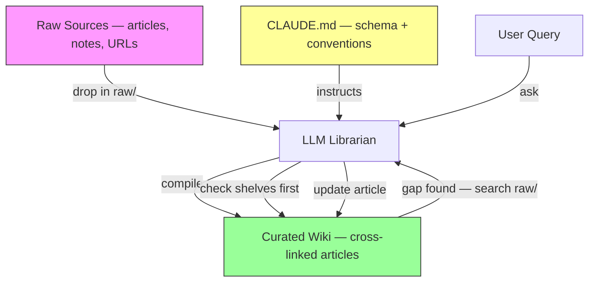

The wiki is a *compounding artifact*. Every source makes it richer. Every query that reveals a gap gets the gap filled. The wiki doesn't just store knowledge — it gets better at storing knowledge.

<p align="center">
  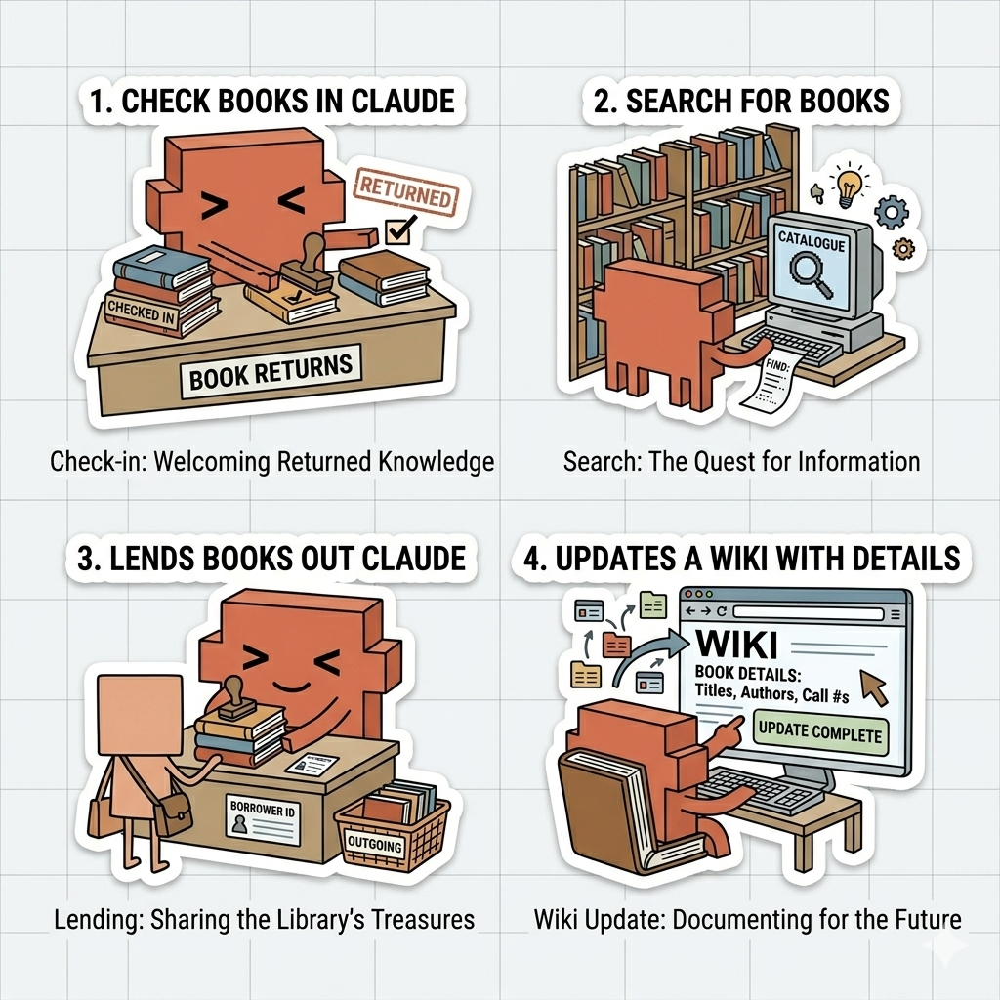
</p>

Three layers:
1. **Raw sources** land in `raw/` — articles, notes, conversation captures, web clips
2. **Claude compiles** them into curated wiki articles in `wiki/` — cross-linked, structured, with key takeaways
3. **CLAUDE.md** defines the schema — topic structure, naming conventions, article lifecycle, contradiction handling

Every query checks the wiki first, falls back to `raw/`, then improves the wiki so the next query doesn't have to. The manifest (`.config/compiled-raw.txt`) tracks which raw files have been compiled — O(1) inventory, not O(n) log scanning.

### Dream Cycles

<p align="center">
  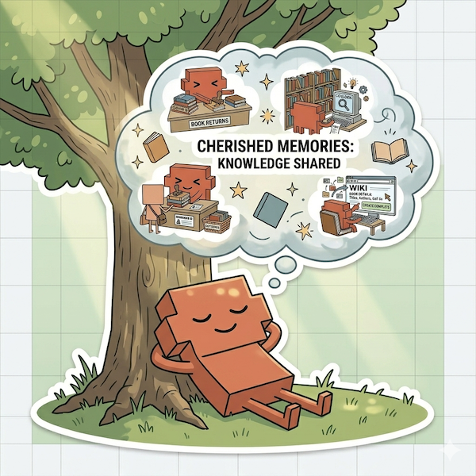
</p>

Two overnight cron jobs trigger dream cycles — think of them as REM sleep for your AI:

- **2:03 AM — Memory dream** (`/dream-memory`): consolidates Claude's session memories — merging duplicates, pruning stale entries, updating the index
- **3:33 AM — Wiki dream** (`/dream-wiki`): compiles any new raw sources into wiki articles

Both follow the same four phases that Anthropic's Auto Dream uses: **Orient → Gather → Consolidate → Prune**.

<p align="center">
  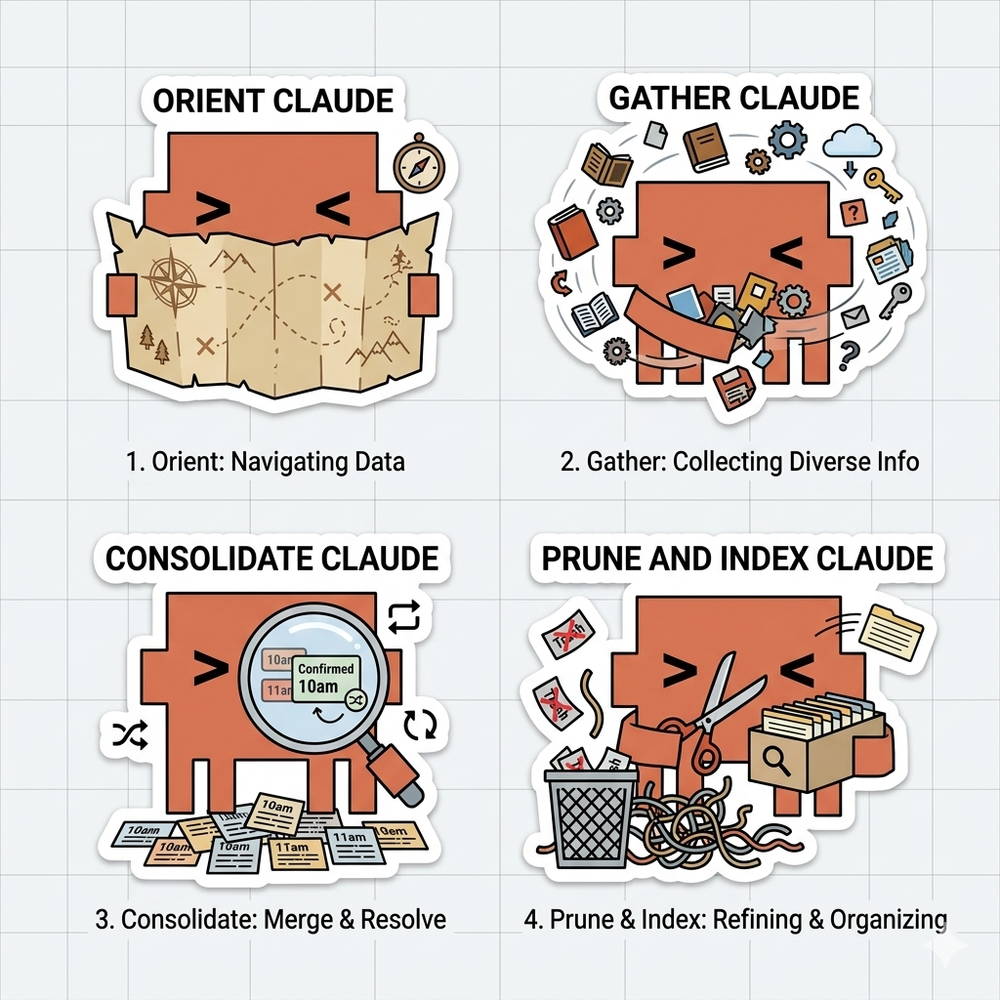
</p>

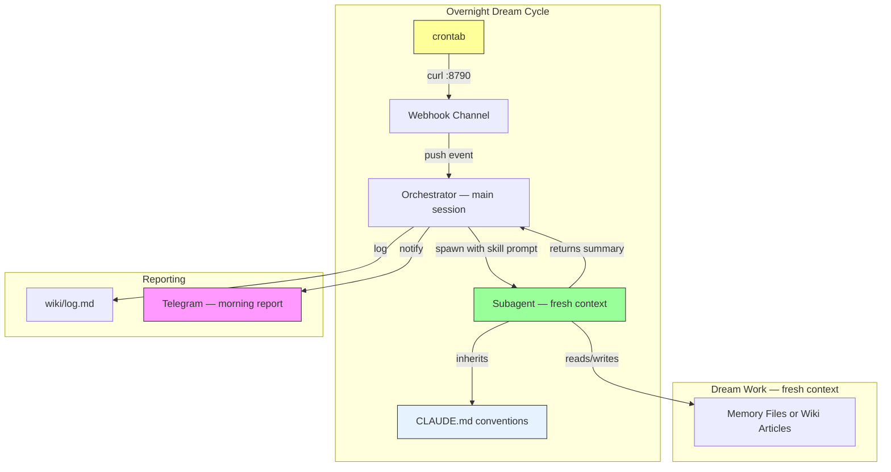

**Why subagents?** Each dream spawns a subagent with fresh context. The orchestrator (the main Claude session) doesn't do the dream work itself — it delegates. This avoids the self-evaluation trap: an agent reviewing its own memories in the same context that created them will rationalise keeping bad entries. A fresh subagent starts clean — no session history, no accumulated biases from the day's conversations. It inherits CLAUDE.md (so it knows the *rules*), but it doesn't know the *day*. Separation creates scepticism.

This is the evaluator principle: the skill says *what* to do, CLAUDE.md says *how things work here*, and the subagent gets both without the baggage.

### Voice Transcription

When a Telegram voice message arrives:

1. Claude downloads the audio via the Telegram `download_attachment` tool
2. Calls the `voice_transcribe` MCP tool
3. voice-tools converts to WAV via ffmpeg, transcribes via whisper.cpp
4. Claude processes the text and replies on Telegram

Fully local — no audio leaves your machine.

### Telegram Gate Hook

CLAUDE.md can tell Claude to acknowledge messages, but instructions are probabilistic — 90% compliance isn't enough for user-visible behaviour. The Telegram gate hook (`.hooks/telegram_gate.py`) is deterministic:

1. A Telegram message arrives → gate closes
2. Claude tries to use any non-Telegram tool → **blocked** (exit code 2)
3. Claude sends a react (eyes emoji) + status reply → gate opens
4. Now Claude can proceed with the actual work

Circuit breaker: after 3 consecutive blocks, the gate forces open with a warning. Standard library Python only — no pip dependencies.

## Intake Workflows

Content enters `raw/` several ways:

| Method | How |
|--------|-----|
| **Obsidian Web Clipper** | Browser extension clips articles directly into `raw/`. One click from any tab. |
| **Manual drop** | Drag files into `raw/` |
| **Conversation capture** | During a Claude session, say "save this to raw" |
| **Telegram** | Send URLs or content to Claude, ask it to save to `raw/` |
| **Daily notes** | Configure Obsidian daily notes to save to `raw/` |

**Web Clipper setup:**

1. Install [Obsidian Web Clipper](https://obsidian.md/clipper) browser extension
2. Set the default vault to this directory
3. Set note location to `raw`
4. Set note name to `{{title}}`

<p align="center">
  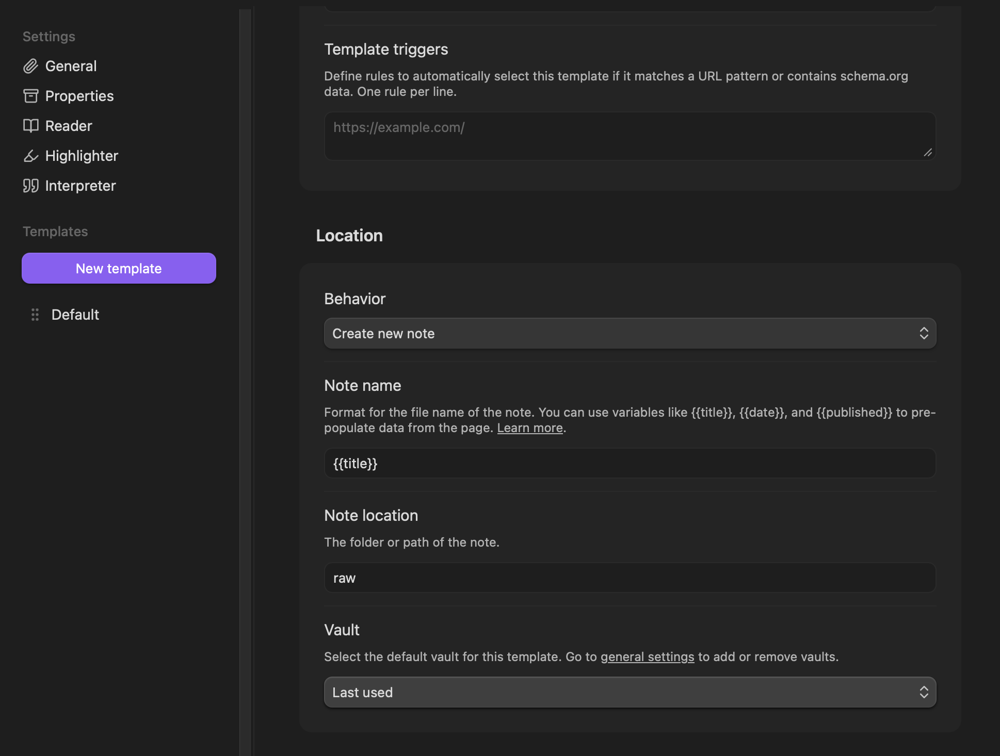
</p>

One click from any browser tab — the article lands in `raw/`, the next dream compiles it into the wiki.

## Obsidian Integration

This repo is designed to be opened directly as an Obsidian vault. Clone it, open it in Obsidian, and everything works:

<p align="center">
  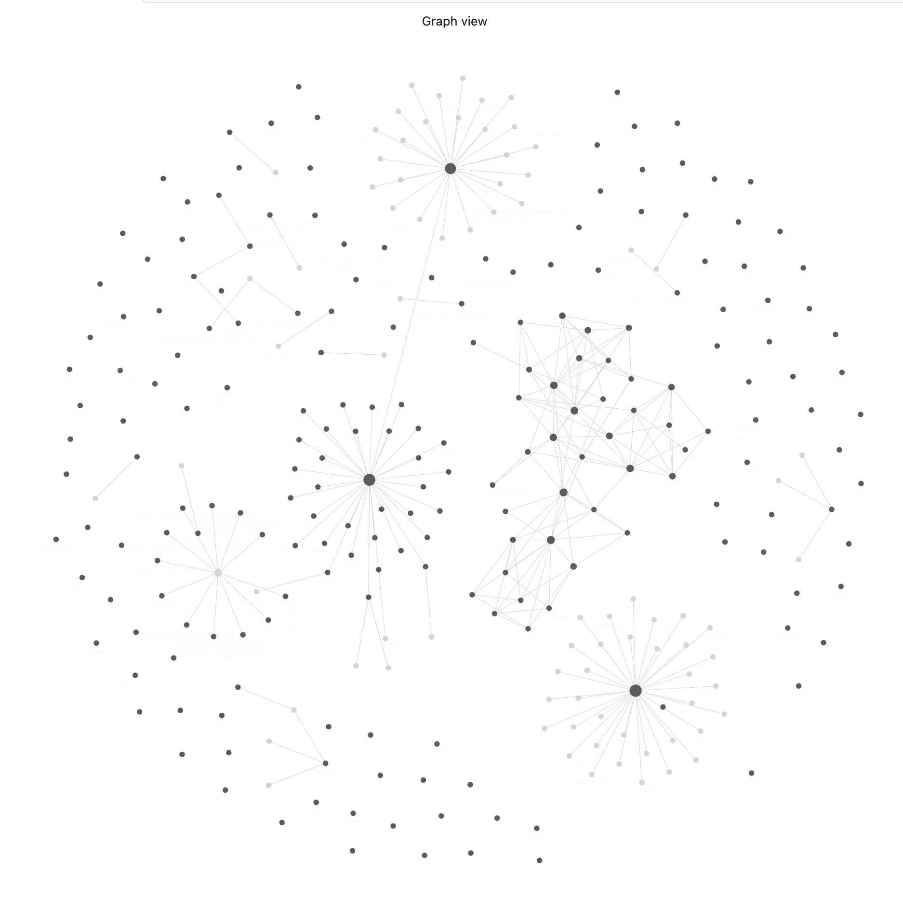
</p>

- `raw/`, `wiki/`, and `output/` appear in the vault — your knowledge content
- Wiki `[[links]]` render as clickable graph connections
- All infrastructure lives in dot-directories (`.channels/`, `.tools/`, `.hooks/`, `.claude/`, `.config/`) — invisible to Obsidian by default
- No JS files, no `node_modules`, no config files polluting your graph view

The dot-directory convention is deliberate: the system lives inside the vault without polluting it. You see your knowledge. Obsidian sees your knowledge. The plumbing is hidden.

### Recommended: Local Images Plus

[Local Images Plus](https://github.com/Sergei-Korneev/obsidian-local-images-plus) downloads external images from clipped articles and stores them locally in the vault. Without it, Web Clipper articles reference remote URLs that may break over time.

Install from Obsidian Community Plugins, then set the media folder to `_resources/${notename}`:

<p align="center">
  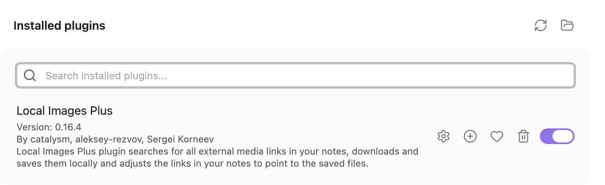
</p>
<p align="center">
  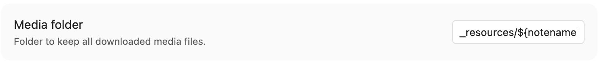
</p>

This keeps images organised per-article inside `_resources/` and ensures clipped content is fully self-contained.

**Optional:** `obsidian` CLI (`npm install -g obsidian-cli`) enables search, daily notes, and append operations from the terminal. Requires Obsidian to be running. Claude falls back to direct file writes if unavailable.

## Configuration Reference

| Variable | File | Default | Description |
|----------|------|---------|-------------|
| `TELEGRAM_CHAT_ID` | config.env | — | Your Telegram chat ID for dream reports |
| `TELEGRAM_BOT_TOKEN` | .channels/telegram/.env | — | Bot token from @BotFather |
| `WEBHOOK_PORT` | .mcp.json | 8790 | Webhook HTTP server port |
| `STT_MODEL` | .mcp.json | — | Path to whisper.cpp GGML model |
| `STT_PATH` | .mcp.json | `whisper-cli` | Whisper binary name |
| Cron schedule | auto-installed | 2:03/3:33 AM | Dream cycle times (`crontab -e` to change) |

## The Biological Memory Model

The system maps onto biological memory more closely than you'd expect. Not as a metaphor — as the actual architecture.

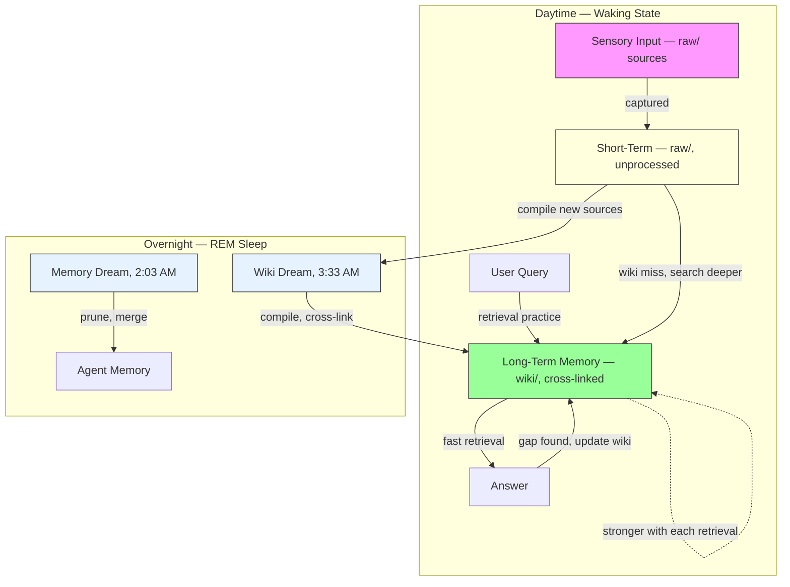

| Biological | Digital |
|-----------|---------|
| Sensory input | `raw/` — articles, notes, clips arrive continuously |
| Short-term memory | Uncompiled raw files — captured but not yet integrated |
| Active study | Compile workflow — reading, synthesising, cross-linking |
| Long-term memory | `wiki/` — curated, structured, retrievable |
| REM sleep | Dream cycles — overnight consolidation by subagents |
| Retrieval practice | Wiki queries — each retrieval strengthens the encoding |
| Synaptic reinforcement | Query fallback loop — wiki miss → raw hit → wiki update |
| Unrehearsed memories | Raw files that never get queried — accessible, but not integrated |

The feedback loop is self-improving. Better wiki leads to faster answers. Faster answers lead to more queries. More queries lead to more consolidation. More consolidation leads to a better wiki. And the dreams keep the whole thing from decaying overnight.

## Troubleshooting

**First thing to check — MCP server status:**

Run `/mcp` inside a Claude session. You should see all three servers connected:

```
  telegram · ✔ connected
  voice-tools · ✔ connected
  webhook-channel · ✔ connected
```

If **webhook-channel** failed: the port in `.mcp.json` is probably already in use by another instance. Change `WEBHOOK_PORT` to a different value.

If **telegram** failed: the plugin path in `.mcp.json` doesn't match your installation. Check `ls ~/.claude/plugins/cache/claude-plugins-official/telegram/` and update the path. Or re-run `./setup.sh` to auto-detect it.

If **voice-tools** failed: the `STT_MODEL` path in `.mcp.json` points to a model file that doesn't exist. Check the path or run `whisper-cli --download-model base.en` to install one.

When in doubt, ask Claude — it can read `.mcp.json` and diagnose the issue.

**Dreams not firing:**
1. Is Claude running? (`./start.sh` must be active)
2. Is the webhook listening? `curl http://127.0.0.1:8790/health`
3. Are cron jobs installed? `crontab -l | grep dream`
4. Does the cron port match `.mcp.json`? `setup.sh` sets this automatically, but if you changed the port after setup, update the cron jobs: `crontab -e`

**Telegram messages dropping:**
- Make sure `start.sh` uses `server:telegram`, not `plugin:telegram`
- Check that `.mcp.json` has the telegram server entry
- Each `--dangerously-load-development-channels` flag must be separate (comma-separated does NOT work)

**Telegram gate blocking everything:**
- Claude gets blocked 3 times then the circuit breaker forces the gate open — this is expected behaviour on first use while Claude learns the pattern
- If it persists, check that the tool names in `.hooks/telegram_gate.py` match your setup: `mcp__telegram__*` for `server:` delivery, `mcp__plugin_telegram_telegram__*` for `plugin:` delivery (the repo includes both)
- The gate only activates on Telegram messages (tagged `source="telegram"`), not CLI input

**`/telegram:configure` overwrites the wrong bot:**
- `/telegram:configure` writes to the global state directory (`~/.claude/channels/telegram/`), not the project-local one
- For multi-instance setups, write the token directly: `echo "TELEGRAM_BOT_TOKEN=<token>" > .channels/telegram/.env`
- `setup.sh` handles this automatically — it prompts for the token and writes to the project-local state dir

**Webhook port mismatch:**
- The webhook port lives in `.mcp.json` (the source of truth), not `config.env`
- `setup.sh` reads the port from `.mcp.json` when installing cron jobs
- If you change the port, update `.mcp.json` and re-install cron jobs: `crontab -e`

**Voice not transcribing:**
- Is `whisper-cli` installed? `which whisper-cli`
- Is `ffmpeg` installed? `which ffmpeg`
- Is `STT_MODEL` set in `.mcp.json` to a valid model path?
- `setup.sh` auto-detects the model at `/opt/homebrew/share/whisper-cpp/models/ggml-base.en.bin` (macOS/Homebrew)

**Wiki not compiling:**
- Check `wiki/log.md` for recent activity
- Check `.config/compiled-raw.txt` — is the file already listed?
- Try manually: tell Claude "compile" in a session

**Manifest out of sync:**
- If articles exist in wiki/ but raw files keep being reprocessed, check `.config/compiled-raw.txt` for filename mismatches (watch for Unicode apostrophes vs ASCII)

## Self-Improvement

The second brain isn't a static system — it's designed to improve itself based on your needs. The [skill-creator](https://github.com/anthropics/skills) from Anthropic enables this: you can ask Claude to create new skills, test them with eval loops, and iterate until they work the way you want.

The dream cycles, wiki compilation, and Telegram communication are all implemented as skills in `.claude/skills/`. If they're not working the way you need, you can use the skill-creator to refine them rather than editing SKILL.md files by hand. The workflow:

1. Tell Claude what you want to change (e.g., "the wiki dream should also check for broken wikilinks")
2. Claude drafts an updated skill, creates test cases, and runs them
3. You review the results in a browser-based viewer
4. Iterate until you're satisfied

This is how the system adapts to you. The CLAUDE.md schema defines *how things work*. The skills define *what gets done*. And the skill-creator lets you reshape the *what* without touching the *how*.

## Background

This project was built as part of the "Dreaming AI" blog series:

- [Part 1: Your AI Should Dream. Mine Does.](https://medium.com/@jason.croucher/part-1-of-dreaming-ai-your-ai-should-dream-mine-does-fa47ed08e742) — the Karpathy wiki pattern, Auto Dream, and building the dream cycles
- [Part 2: The Dream Worked. So I Built a Brain.](https://medium.com/@jason.croucher/part-2-of-dreaming-ai-the-dream-worked-so-i-built-a-brain-9a80b9fca217) — self-evaluation trap, subagent architecture, biological memory model, and this repo

The codebase draws from:
- [claude-channels](https://github.com/jason-c-dev/claude-channels) — webhook-channel, voice-tools, and Telegram gate
- [Karpathy's LLM Wiki gist](https://gist.github.com/karpathy/442a6bf555914893e9891c11519de94f) — the wiki pattern
- Anthropic's Auto Dream system — the memory consolidation model

## License

[MIT](LICENSE)
